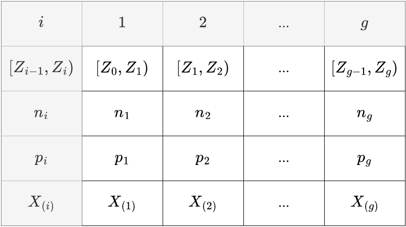
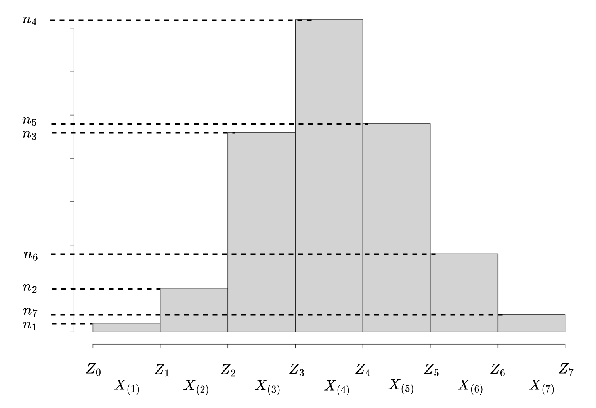

```{r, echo=FALSE}
knitr::opts_chunk$set(echo = TRUE, dev="cairo_pdf")
```

# **Постановка задачи**

Для выполнения практического задания необходимо:

1.  Скачать папку с исходными данными по
    [ссылке](https://disk.yandex.ru/d/PwFd-L8zn7x8eQ). Открыть папку,
    соответствующую своей группе. Далее открыть папку с вариантом,
    совпадающим с вашим номером в списке.

2.  В папке 6 файлов с данными. Данные имеют различные распределения: 
  
- 1 и 4 файлы - нормальное распределение; 
- 2 и 5 файлы - равномерное распределение; 
- 3 и 6 файлы - показательное распределение.

Необходимо идентифицировать распределения в каждом файле двумя способами: 
- с помощью критерия согласия Пирсона; 
 -методом анаморфоз.

3.  Методом Пирсона для каждого файла нужно проверить истинное
    распределение (то, к которому действительно относятся данные в
    файле, оно дано выше) и одно ложное. Например, если данные в файле
    распределены нормально, то нужно проверить нормальное распределение
    и одно из двух: показательное или равномерное. При расчете
    теоретических частот в качестве параметров распределений брать их
    точечные несмещенные оценки.

4.  В отчет вставить гистограммы по каждому файлу, расчетные формулы и
    результаты проверки распределения.

5.  При проверке распределения методом анаморфоз нужно построить 3
    графика для каждого из 6 файлов. Каждый график представлен в
    координатах соответствующей анаморфозы. Тот график, на котором
    достигнуто спрямление, соответствует истинному распределению. Для
    проверки качества спрямления необходимо построить линейный тренд
    (провести линейную регрессию) и показать значения коэффициента
    детерминации ($R^2$). Он должен быть близок к 1.

6.  По параметрам прямой (угловому коэффициенту и свободному члену)
    найти параметры распределения. Для построения анаморфозы нормального
    распределения мат. ожидание заменить его несмещенной точечной
    оценкой.

7.  В выводах сравнить результаты, полученные двумя способами.

# **Теоретическое введение**

## **Важность проверки распределений**

Тестирование гипотезы о подчинении выборки одному из случаных
распределений играет важную роль в прикладных задачах статистики и
анализа данных. Важную роль распределения играют:

1.  В имитационных моделях деятельности системы, т.к. позволяют
    моделировать очень сложные процессы на основе теоретических
    распределений вероятности отказа оборудования, времени ответа на
    звонок покупателя, времени обслуживания клиента, интенсивности
    поступающих задач и т.п.

2.  В предиктивной аналитике, на основе принадлежности остатков реальных
    данных и модели можно судить о полноте предсказательной модели ввиду
    нормальной распределенности остатков вокруг моделируемой
    зависимости.

3.  В статистике важна процедура проверки гипотез для ситуаций принятия
    решений на основе данных. Проверку гипотез важно проводить на данных
    опираясь на известные законы распределений и их уровни значимости и
    диапазоны случайности.

Прикладных областей для проверки распределения выборки можно привести
гораздо больше. Однако, в реальных задачах также может получиться что
данные не относятся к ранее известным теоретическим распределениям. В
результате важно уметь пользоваться аппаратом статистики и разрабатывать
метрики способные нам помочь в решении вышеприведенных задач.

Для решения задачи проверки гипотезы о подчинении выборки ранее
известным теоретическим распределениям необходимо знать статистические
критерии проверки гипотез с заранее заданным уровнем надежности. Среди
множества процедур можно выделить две универсальные:

1.  Проверка гипотез на основе критерия $\chi^2$-Пирсона.

2.  Проверка распределений на основе применения процедуры спрямления
    функциональной зависимости в декартовых координатах с помощью
    аппарата **анаморфоз**.

Также существуют частные случаи проверки гипотез для конкретных
распределений, например для проверки **нормальности распределения**.
Такие критерии важны в угоду большого числа статистических процедур,
требующих нормальности распределения данных.

## **Этап подготовки данных**

Пусть дана выборка $X \in \mathbb{R}^N, N\in \mathbb{N}$, где каждое
значение выборки представлено вещественным числом и можность множества
$X$ равна $N$:

$$
X = (x_1, x_2, \dots, x_N), \ x_i \in \mathbb{R}\ , \ i=\overline{1,N}
$$

Необходимо проверить подчиняется ли $X$ одному из заранее известных
законов распределения $p(x\ |\ \theta)$ с надежностью
$\gamma \in (0, 1)$.

Перед применением тестов необходимо сформировать гистограммы данных и
расcчитать число групп $g$, границы групп $Z_i,\ i\in \overline{0,g}$,
абсолютные и относительные частоты групп
$(n_j, p_j),\ j \in \overline{1,g}$, опираясь на значения полученной
выборки данных.

Число групп $g$ определяется по правилу Стерджеса:

$$
g = 1 + \lfloor \log_2(N) \rfloor.
$$

Границы групп рассчитываются по имеющемуся числу групп:

$$
h = \frac{max(X) - min(X)}{g},
$$

$$
Z_i = min(X) + i \cdot h, \ i \in \overline{0, g}.
$$

Затем необходимо построить вариационный ряд для подсчёта абсолютных и
относительных частот:

{ width=75% }

Абсолютные частоты $n_i$ считаются как количество вхождений значений из выборки $X$ в соответствующий $n_i$ интервал $[Z_{i-1}, Z_{i})$.

Остносительные частоты $p_i$ рассчитываются как:

$$
p_i = \frac{n_i}{N}, \ i \in \overline{1, g}.
$$

Середины интервалов $X_{(i)}$:

$$
X_{(i)} = \frac{Z_{i} - Z_{i - 1}}{2}, \ i \in \overline{1,g}.
$$

По результатам расчетов вариационного ряда наступает возможность визуализировать практическое приближенное распределение значений выборки в виде гистограммы:

{width=75%}


При этом все основные показатели моментов распределения можно считать дискретно по определению моментов дискретных распределений и получатьт точечные несмещенные оценки для:

1. Математического ожидания

$$
\hat{E}[x] = \sum_{i=1}^{g} X_{(i)} \cdot p_{i} \approx E[x],
$$

2. Дисперсии

$$
\hat{D}[x] = \sum_{i=1}^{g} \left( \left( X_{(i)} - \hat{E}[x] \right)^2 \cdot p_i \right) \approx D[x],
$$

3. Среднего квадрата отклонения

$$
\hat{\sigma}[x] = \sqrt{\hat{D}[x]} \approx \sigma[x].
$$

## **Критерий согласия** $\chi^2$-Пирсона

Проверка на принадлежность выборки известному распределению с помощью критерия согласия $\chi^2$-Пирсона проводится на основе расчета следующей метрики:

$$
\chi^2 = \sum_{i=1}^{g} \frac{(n_i - n_i^{'})^2}{n_i^{'}}, 
$$

$$
n_i^{'} = N \cdot P(X_{(i)} \ |\ \Theta) = N \cdot \left( P(Z_{i}\ | \ \Theta)\ -\ P(Z_{i-1}\ | \ \Theta)  \right),
$$
где $P(x \ | \ \Theta) = \int_{-\infty}^{x}\ p(t\ |\ \theta)\ dt\ -$ известная функция распределения, вычисленная с параметрами $\Theta = (\theta_1, \theta_2, \dots)$, которые необходимы для расчета значения данной функции.

При проверке принадлежности выборки распределению ставится задача проверки гипотезы:

$H_0$: Выборка $X$ распределена по известному закону распределения с функцией плотности $p(x\ |\ \Theta)$ с уровнем надежности $\gamma$.

При проверке гипотезы стоит условиться, что метрика $\chi^2 = \sum_{i=1}^{g} \frac{(n_i - n_i^{'})^2}{n_i^{'}}$ распределена по $\chi^2$, что означает для нас известные диапазоны случайности и известные критические значения при проверке гипотезы.

Гипотеза $H_0$ принимается при $\chi^2 < \chi_{\gamma, k}^2$, при $k = g - cap(\Theta) - 1$.

## **Известные функции распределения и функции плотности распределения**

### **Нормальное распределение**

Функция плотности нормального распределения $p(x\ | \ \Theta)$ задается следующим образом при известных параметрах $\Theta = (\theta_1 = \mu, \theta_2 = \sigma^2)$:

$$
p(x \ | \ \Theta) = \frac{1}{\sqrt{2 \pi \sigma^2}} \cdot exp\left({-\frac{(x - \mu)^2}{2 \sigma^2}}\right) ,
$$

Функция нормального распределения $P(x\ |\ \Theta)$ задается следующим образом при известных параметрах $\Theta = (\theta_1 = \mu, \theta_2 = \sigma^2)$:

$$
P(x \ | \ \Theta) = \frac{1}{\sqrt{2 \pi \sigma^2}} \cdot \int_{-\infty}^{x} exp\left({-\frac{(t - \mu)^2}{2 \sigma^2}}\right) dt
$$

Графики функций при $\Theta = (\mu = 0, \sigma^2 = 1)$ представлены ниже:

$$
\ 
$$

```{r, echo=F, fig.align='center', out.width="75%"}
grid <- seq(-4, 4, 0.001)
p_x <- dnorm(grid)
P_x <- cumsum(p_x) * 0.001

plot(grid, P_x, type = "l", col = "blue", lwd = I(1.5),
     main = "Нормальное распределение", xlab = "x", ylab = "P(x), p(x)")
lines(grid, p_x, type = "l", col = "red", lwd = I(1.5))
legend(x = -4, y = 1.0, legend = c("P(x)","p(x)"), col = c("blue", "red"), lwd = c(I(1.5), I(1.5)))
grid()
```

$\ $

### **Равномерное распределение**

Функция плотности равномерного распределения $p(x\ | \ \Theta)$ задается следующим образом при известных параметрах $\Theta = (\theta_1 = a, \theta_2 = b)$:

$$
p(x\ | \ \Theta) = \left\{\begin{matrix} 0, & x\in (-\infty, a)\ \cup\ [b, \infty)  \\
1/(b - a), & x\in [a, b).\end{matrix}\right. , \ E[x] = \frac{b+a}{2}, \ D[x] = \frac{(b-a)^2}{12},
$$
где $E[x]\ -$ математическое ожидание, $D[x] \ -$ дисперсия.

Функция равномерного распределения $P(x\ |\ \Theta)$ задается следующим образом при известных параметрах $\Theta = (\theta_1 = a, \theta_2 = b)$:

$$
\int_{a}^{x} \frac{1}{b-a} dt\ = \left.\ \frac{t}{b-a}\ \right|_{t=a}^{t=x}\ = \frac{x}{b-a} - \frac{a}{b-a} = \frac{1}{b-a} (x - a) 
$$

$$
P(x\ |\ \Theta) = \int_{-\infty}^{x} p(t\ |\ \Theta) dt = \left\{
\begin{matrix} 
0, & x\in (-\infty, a)  \\
\frac{1}{b - a} \cdot (x-a) , & x \in [a, b),\\
1, & x \in [b, \infty).  
\end{matrix}
\right.
$$

Графики функции равномерного распределения и функции плотности равномерного распределения с параметрами $\Theta=(a=-1,\ b = 3)$ представлены ниже:

$$
\ 
$$

```{r, echo=F, dpi=600, fig.align='center', out.width="75%"}
grid <- seq(-2.5, 4.5, 0.001)
p_x <- dunif(grid, -1, 3)
P_x <- cumsum(p_x) * 0.001

plot(grid, P_x, type = "l", col = "blue", lwd = I(1.5),
     main = "Равномерное распределение", xlab = "x", ylab = "P(x), p(x)")
lines(grid, p_x, type = "l", col = "red", lwd = I(1.5))
legend(x = -2.5, y = 1.0, legend = c("P(x)","p(x)"), col = c("blue", "red"), lwd = c(I(1.5), I(1.5)))
grid()
```

$\ $

### **Показательное распределение**

Функция плотности показательного распределения $p(x\ | \ \Theta)$ задается следующим образом при известных параметрах $\Theta = (\theta_1 = \lambda)$:

$$
p(x\ | \ \Theta) = \lambda \cdot exp(-\lambda x),\  E[x] = \frac{1}{\lambda},\ \ D[x] = \frac{1}{\lambda^2},
$$
где $E[x]\ -$ математическое ожидание, $D[x]\ -$ дисперсия.


Функция плотности показательного распределения $P(x\ | \ \Theta)$ задается следующим образом при известных параметрах $\Theta = (\theta_1 = \lambda)$:

$$
P(x \ | \ \Theta)=\left\{{\begin{matrix}1-e^{{-\lambda x}}&,\;x\geq 0,\\0&,\;x<0.\end{matrix}}\right.
$$

Графики функции показательного распределения и функции плоности показательного распределения для значения параметра $\lambda = 0.7$ представлены ниже:

$$
\ 
$$

```{r, echo=F, dpi=600, fig.align='center', out.width="75%"}
grid <- seq(-0.5, 6, 0.001)
p_x <- dexp(grid, 0.7)
P_x <- cumsum(p_x) * 0.001

plot(grid, P_x, type = "l", col = "blue", lwd = I(1.5),
     main = "Показательное распределение", xlab = "x", ylab = "P(x), p(x)")
lines(grid, p_x, type = "l", col = "red", lwd = I(1.5))
legend(x = -0.5, y = 1.0, legend = c("P(x)","p(x)"), col = c("blue", "red"), lwd = c(I(1.5), I(1.5)))
grid()
```

$\ $

## **Проверка распределений на основе критерия согласия $\chi^2$-Пирсона**

Приведем пример проверки выборки на нормальность распределения значений на основе расчета значения оценки параметра $\chi^2$ и проверки данного значения на принадлженость распределению $\chi_{\gamma, k}^2$ с $k = g - cap\Theta - 1$ степенями свободы.

Сгенерируем выборку на основе нормального распределения при помощи встроенной в **R** функции **rnorm(n, mean, sd)** при значениях параметров $\Theta = (\mu = 26.7, \sigma = 3.5)$

Для выборки необходимо будет составить таблицу гистограммы, рассчитать абсолютные и относительные частоты, середины групп и получить значения точечных несмещенных оценок $\hat{E}[x]$ и $\hat{\sigma}[x]$  для рассматриваемого нами нормального распределения.

```{r, results='hide', include=FALSE}
library(dplyr)
```

$\ $

```{r}
set.seed(123)

mu_param <- 26.7                         # Math Expectation of X_sample
sigma_param <- 3.5                       # Sigma of X_sample
N <- 100                                 # Number of members in X_sample

n_groups = 1 + floor(log2(N))                       # Number of hist groups
X_sample <- round(rnorm(n = N, 
                        mean = mu_param, 
                        sd = sigma_param), 3)       # X_sample generation


h <- (max(X_sample) - min(X_sample)) / n_groups     # Hist step

Z <- seq(from = min(X_sample),
         to = max(X_sample),
         by = h)                                    # Hist boundaries

X <- (Z[-1] + Z[-length(Z)]) / 2                    # Hist centers

table_cut <- data.frame(values = X_sample, 
                        groups = cut(X_sample, n_groups)) # Table of quants

print(head(table_cut))                              # Table of values and groups
```

$\ $

Выше мы определили выборку и поставили в соответствие каждому значению из выборки его группу, чтобы в дальнейшем сделать группировку по факторной переменной (groups).

$\ $

```{r}
# GroupBy 'groups' and calculate Absolute and Relative frequences
table_hist <- table_cut %>% 
  dplyr::group_by(groups) %>% 
  dplyr::summarise(abs_freq = n(),
                   rel_freq = n()/N)

table_hist$low <- round(Z[-length(Z)], 1)           # Lower bound of columns
table_hist$upp <- round(Z[-1], 1)                   # Upper bound of columns
table_hist$med <- round(X, 1)                       # Middle of columns

print(table_hist)
```

$\ $

По данной таблице рассчитаем значения для математического ожидания и СКО:

$\ $

```{r}
mu_sample <- sum(table_hist$med * table_hist$rel_freq)
print(mu_sample)
```

$\ $

```{r}
sd_sample <- sqrt(sum((table_hist$med - mu_sample)^2 * table_hist$rel_freq))
print(sd_sample)
```

$\ $

Таким образом мы получили несмещенные точечные оценки для математического ожидания и СКО:

1. математическое ожидание $\hat{E}[x] \approx 26.93$

2. средний квадрат отклонения от среднего $\hat{\sigma}[x] \approx 3.24$

Отобразим гистограмму полученного эмпирического распределения:

$\ $

```{r, echo=F, fig.align='center', out.width="75%"}
grid <- seq(mu_sample - 2.5 * sd_sample, mu_sample + 2.5 * sd_sample, 0.001)

plot(x = table_hist$med, 
     y = table_hist$rel_freq / h, 
     type="h", xlab = "X(i)", ylab = "n_i")
lines(x = table_hist$med, 
      y = table_hist$rel_freq / h, 
      type = "o", col = "red", pch=19)
lines(grid, dnorm(grid,mu_sample,sd_sample), col="blue")
legend(x = 19, y = 0.12, 
       legend = c("Теор. распределение", "Гист. выборки X"),
       col = c("blue", "red"), 
       lty = c(1, 1))
grid()
```

$\ $

Вычислим метрику $\chi^2$ для эмпирического распределения нашей выборки при наличии оцененных параметров нормального распределения. Для этого воспользуемся инструментом встроенного интегрирования в **R** $-$ функцией **integrate(func, lower, upper, ..., abs.tol)**. Вычислим на её основе значение интеграла от функции плотности нормального распределения при известных оцененных параметрах распределения в точке $x = 25.9$:

$\ $

```{r}
integrate(f = dnorm,               # Func to integrate
          lower = -Inf,            # Low bound
          upper = 25.9,            # Upper bound
          mean = mu_sample,        # Param1
          sd = sd_sample,          # Param2
          abs.tol = 0)             # Absolute error
```

$\ $

Для интеграла получаем значение:

$$
P(x = 25.9\ |\ \Theta = (\mu = 26.93, \sigma = 3.24)) = \frac{1}{\sqrt{2\pi \sigma}} \int_{-\infty}^{25.9} e^{-\frac{(t-\mu)^2}{2\sigma^2}}  dt = 0.3758804
$$
Протестировав данный метод получения знвчений функции распределения вероятностей опишем общий способ нахождения значений нормального распределения.

Зададим функцию для вычисления интеграла функции плотности нормального распределения:

$\ $

```{r}
interg_normal <- function(low=-Inf, high=Inf, mean_param=0, sd_param=1) {
  unlist(
    integrate(f = dnorm, 
              mean = mean_param, 
              sd=sd_param, 
              lower=low, 
              upper=high, 
              abs.tol=0)[1]
    )
}
```

$\ $

А также функцию для вычисления значения $\chi^2$-метрики:

$\ $

```{r}
chisq_test_norm <- function(table_hist, mean_p, sd_p) {
  N <- sum(table_hist$abs_freq)
  prac <- table_hist$abs_freq
  theor <- numeric(nrow(table_hist))
  for (i in 1:nrow(table_hist)) {
    theor[i] <- N * (interg_normal(high = table_hist$upp[i], 
                                   mean_param = mean_p, 
                                   sd_param = sd_p) - 
                       interg_normal(high = table_hist$low[i], 
                                     mean_param = mean_p, 
                                     sd_param = sd_p))
  }
  chisq_d <-sum((prac - theor)^2 / theor)
  return(chisq_d)
}
```

$\ $

Вычислим значение $chi^2$-метрики и сравним его с критическим значением метрики на правой границе квантиля $\gamma = 0.95$ для $chi^2$-распределения с $k = g - cap\Theta  - 1$ степенями свободы:

$\ $

```{r}
chisq_test <- chisq_test_norm(table_hist = table_hist, 
                              mean_p = mu_sample, 
                              sd_p = sd_sample)

chisq_test < qchisq(p=0.975, df = n_groups - 2 - 1)
```

$$\ $$

```{r, echo=F, fig.align='center', out.width="75%"}
x_axis <- seq(0, qchisq(0.99, n_groups - 2 - 1), 0.001)
plot(x_axis, dchisq(x_axis, n_groups - 2 - 1), type="l",
     xlab = "Теоретические возможные значения выборки",
     ylab = "Теоретическая вероятность",
     main = paste0("Теоретическая плоность распределения chi^2 с df = ", n_groups - 2 - 1))
abline(v = c(chisq_test, qchisq(0.975, n_groups - 2 - 1)), col = c("blue", "red"))
text(x = c(chisq_test, qchisq(0.975, n_groups - 2 - 1)) + c(1.5, -1.8), y = 0.05, 
     labels = c(paste0("Chi^2 = ", round(chisq_test, 2)), 
                paste0("Chi_crit^2 = ", round(qchisq(0.975, n_groups - 2 - 1), 2))))
grid()
```

$\ $

Полученный результат получился действительно значительно меньше значения границы критической области, что уверенно подтверждает принадлежность выборки к нормальному распределению.

## **Проверка распределений на основе анаморфоз**

В истории математики известно понятие абак (доска). Декартов абак уравнения с двумя переменными $f(x,y) = 0$ есть
график этого уравнения, построенный в системе декартовых координат $х, у$. При построении декартова абака на осях координат
могут быть взяты функциональные шкалы $x = φ(u)$, $y = \psi (v)$. 

Такое преобразование называется анаморфозой, если преобразует систему намеченных линий абака в прямолинейный пучок. Анаморфоза возможна, если уравнение $f(u,v,w,z)=0$ может быть приведено к виду 

$$
f_1( w) \cdot φ(u) + f_2 (w) \cdot ψ(v) = f_3(w). \ \ \ (a)
$$ 

(Уравнения функциональных шкал должны иметь вид

$$
x = m_1 \cdot φ(u)\ \text{ и }\ y = m_2 \cdot ψ (v) , 
$$
где $m_1$ и $m_2$ - модули шкал. Логарифмическая анаморфоза есть анаморфоза, произведенная построением на осях координат логарифмических шкал. Она возможна для уравнений вида 

$$
f (w) = a \cdot  u^{φ(u)} \cdot v^{ψ(v)} ,
$$
которое логарифмированием приводится к виду (а).

Использование анаморфоз, в которых исходные данные линеаризуется, приводит к выделению участков, соответствующих выбранному распределению. Таким образом, решается вопрос о выделении участков, на которых исходные данные соответствуют тестируемой модели, и определения параметров функции аппроксимации, так как они могут быть получены из уравнений этих прямых.

Благодаря спрямлению исходных данных в координатах, соответствующих определенным распределениям, можно решить вопрос о подборе подходящего класса функций на регулярной основе. Путем перебора анаморфоз, соответствующих различным
вероятностным распределениям, можно выбрать то распределение, которое линеаризует исходные данные. Анаморфоза, которая
спрямляет данные на большем интервале, чем другие, будет иметь наивысший ранг значимости.

Построение анаморфоз основано, в частности, на следующих преобразованиях координат: логарифмирование, сдвиг и
растяжение аргумента, инверсия функции или аргумента, сдвиговых фазовых траекториях.

### **Анаморфозы нормального распределения**

Анаморфоза нормального распределения может быть получена из уравнения для плотности нормального распределения путем логарифмирования правой и левой частей:

$$
ln(p(x\ |\ \Theta)) = ln\left( \frac{1}{\sqrt{2 \pi \sigma^2}} \cdot exp\left( -\frac{(x - \mu)^2}{2\sigma^2} \right) \right),
$$
затем необходимо привести итоговое преобразование координат
$$
ln(p(x_i\ |\ \Theta)) = ln\left( \frac{1}{\sqrt{2 \pi \sigma^2}} \right) - \frac{(x - \mu)^2}{2\sigma^2},
$$

или, если раскрыть первый логарифм, то

$$
ln(p(x_i\ |\ \Theta)) = - ln\left(\sqrt{2 \pi \sigma^2} \right) - \frac{(x - \mu)^2}{2\sigma^2}. 
$$

Если $y(x_i) = ln(p(x_i\ |\ \Theta))$, а параметры линеаризующей прямой $a = - 1/(2\sigma^2), \ b = -ln\left(\sqrt{2 \pi \sigma^2} \right)$, то представленное выше уравнение можно переписать в виде уравнения прямой для дискретного набора точек $(x_i, y_i), \ i \in \overline{1, g}$, которые подчиняются нормальному распределению. 

Построение данных, соответствующих нормальному распределению, получает спрямление в координатах $ln(p) \sim (x - \mu)^2$ .

Покажем работу анаморфозы на модельных сгенерированных псевдослучайных данных с помощью функции **rnorm** пакета **R** со значением параметров $\mu = 13.2, \sigma = 0.9$.

$\ $

```{r}
set.seed(12)

N <- 100                                        # Number of rows in sample
mu_param <- 13.2                                # Mu param
sigma_param <- 0.9                              # Sigma param
X_sample <- rnorm(n = N, 
                  mean = mu_param, 
                  sd = sigma_param)             # Sample generation

n_groups <- 1 + floor(log2(N))                      # Number of groups

h <- (max(X_sample) - min(X_sample)) / n_groups     # Hist step

Z <- seq(from = min(X_sample),
         to = max(X_sample),
         by = h)                                    # Hist boundaries

X <- (Z[-1] + Z[-length(Z)]) / 2                    # Hist centers

table_cut <- data.frame(values = X_sample, 
                        groups = cut(X_sample, n_groups)) # Table of quants

print(head(table_cut))                             # Table of values and groups
```

$\ $

Приведем пример кода построения таблицы гистограммы для отквантованных данных:

$\ $

```{r}
# GroupBy 'groups' and calculate Absolute and Relative frequences
table_hist <- table_cut %>% 
  dplyr::group_by(groups) %>% 
  dplyr::summarise(abs_freq = n(),
                   rel_freq = n()/N)

table_hist$low <- round(Z[-length(Z)], 1)           # Lower bound of columns
table_hist$upp <- round(Z[-1], 1)                   # Upper bound of columns
table_hist$med <- round(X, 1)                       # Middle of columns

print(table_hist)
```

$\ $

По полученной таблице гистограммы получим возможность рассчитать параметры полученного распределения:

$\ $

```{r}
mu_sample <- sum(table_hist$med * table_hist$rel_freq)
sd_sample <- sqrt(sum((table_hist$med - mu_sample)^2 * table_hist$rel_freq))
```

$\ $

Получим значения по выборке для описательных статистик

1. математическое ожидание $\hat{E}[x] \approx 13.18$,
2. средний квадрат отклонений $\hat{\sigma}[x] \approx 0.79$.

Построим гистограмму относительных частот:

$\ $

```{r, fig.align='center', out.width="75%", dpi=600}
plot(x = table_hist$med,
     y = table_hist$rel_freq,
     col = "red",
     type = "o",
     pch = 19,
     lwd = I(1.2),
     xlab = "X(i)", ylab = "pi")
grid()
```

$\ $

Построим гистограмму распределения в спрямляющих координатах $ln(p) \sim (x - \hat{E}[x])^2$ по известному полученному значению математического ожидания:

$\ $

```{r, fig.align='center', out.width="75%", dpi=600}
plot(x = (table_hist$med - mu_sample)^2,
     y = log(table_hist$rel_freq),
     col = "red",
     type = "o",
     pch = 19,
     lwd = I(1.2),
     xlab = "X(i)", ylab = "ln(pi)")
grid()
```

$\ $

Для полученной зависимости $ln(p) \sim (x - \hat{E}[x])^2$ необходимо методом наименьших квадратов построить линейную модель $p = ax + b$, и найти параметры прямой для определения параметров распределения и подсчёта метрики $R^2$ с целью идентифицировать распределение.

$\ $

```{r}
ln_p <- log(table_hist$rel_freq)                # У
x <- (table_hist$med - mu_param)^2              # X

linear_model <- lm(ln_p ~ x)                    # Linear model ln_p of x
a <- linear_model$coefficients[2]               # Slope  
b <- linear_model$coefficients[1]               # Intercept

print(linear_model)
```

$\ $

Intercept переводится как пересечение и по смыслу есть значение коэффициента $b = -1.3363$. Коэффициент при переменной является углом наклона и по модели есть значение $a = -0.6979$. Отобразим данную модель на графике гистограммы и расчитаем $R^2$

$\ $

```{r, fig.align='center', out.width="75%", dpi=600}
plot(x = x,
     y = ln_p,
     col = "red",
     type = "o",
     pch = 19,
     lwd = I(1.2),
     xlab = "X(i)", ylab = "ln(pi)")
abline(a = b, 
       b = a, 
       col = "blue", 
       lwd = I(1.2))
legend(x = 2.25, y = -1.4, 
       legend = c("ln(p_i)", "ax + b"), 
       col = c("red", "blue"),
       lty = c(1, 1))
grid()
```

$\ $

Расчет $R^2$ можно произвести воспользовавшись функцией **cor(x,y)** из языка **R**:

$\ $

```{r}
mod_ln_p <- a * x + b
R2 <- cor(ln_p, mod_ln_p)^2

print(R2)
```

$\ $

Полученное значение $R^2 \approx 0.954$, следовательно моделируемая зависимость действительно подчиняется нормальному распределению.

Полученные метрики для математического ожидания и дисперсии получаются из параметров полученной прямой по результатам построения линейной модели по МНК:

1. Угол наклона прямой: $a = -1/(2\sigma^2) \approx -0.6979$,

2. Пересечение с осью $OY$: $b = -ln\left(\sqrt{2 \pi \sigma^2} \right) \approx -1.3363$

### **Анаморфозы показательного распределения**

Анаморфоза показательного распределения может быть получена из уравнения для плотности показательного распределения путем логарифмирования правой и левой частей:

$$
ln(p(x\ |\ \Theta)) = ln(\lambda exp(-\lambda x)),
$$
затем необходимо привести итоговое преобразование координат
$$
ln(p(x_i\ |\ \Theta)) = ln(\lambda) - \lambda \cdot x_i.
$$

Если $y(x_i) = ln(p(x_i\ |\ \Theta))$, а параметры линеаризующей прямой $a = -\lambda, \ b = ln(\lambda)$, то представленное выше уравнение можно переписать в виде уравнения прямой для дискретного набора точек $(x_i, y_i), \ i \in \overline{1, g}$, которые подчиняются показательному распределению. 

Построение данных, соответствующих экспоненциальному распределению, получает спрямление в координатах $ln(p) \sim x$ .

Покажем работу анаморфозы на модельных сгенерированных псевдослучайных данных с помощью функции **rexp** пакета **R** со значением параметра $\lambda = 0.87$.

$$\ $$

```{r}
set.seed(12)

N <- 100                                        # Number of rows in sample
lambda_param <- 0.87                                # Lambda param
X_sample <- rexp(n = N, rate = lambda_param)        # Sample generation

n_groups <- 1 + floor(log2(N))                      # Number of groups

h <- (max(X_sample)) / n_groups                     # Hist step

Z <- seq(from = 0,
         to = max(X_sample),
         by = h)                                    # Hist boundaries

X <- (Z[-1] + Z[-length(Z)]) / 2                    # Hist centers

table_cut <- data.frame(values = X_sample, 
                        groups = cut(X_sample, Z)) # Table of quants

print(head(table_cut))                             # Table of values and groups
```

$\ $

Приведем пример кода построения таблицы гистограммы для отквантованных данных:

$\ $

```{r}
# GroupBy 'groups' and calculate Absolute and Relative frequences
table_hist <- table_cut %>% 
  dplyr::group_by(groups) %>% 
  dplyr::summarise(abs_freq = n(),
                   rel_freq = n()/N)

table_hist$low <- round(Z[-length(Z)], 2)           # Lower bound of columns
table_hist$upp <- round(Z[-1], 2)                   # Upper bound of columns
table_hist$med <- round(X, 2)                       # Middle of columns

print(table_hist)
```

$\ $

Построим гистограмму относительных частот:

$\ $

```{r, out.width="75%", fig.align='center', dpi=600, echo=F}
plot(x = table_hist$med,
     y = table_hist$rel_freq,
     col = "red",
     type = "o",
     pch = 19,
     lwd = I(1.2),
     xlab = "X(i)", ylab = "pi")
grid()
```

$\ $


Построим гистограмму распределения в спрямляющих координатах $ln(p) \sim x$:

$\ $

```{r, out.width="75%", fig.align='center', dpi=600, echo=F}
plot(x = table_hist$med,
     y = log(table_hist$rel_freq),
     col = "red",
     type = "o",
     pch = 19,
     lwd = I(1.2),
     xlab = "X(i)", ylab = "ln(pi)")
grid()
```

$\ $

Для полученной зависимости $ln(p) \sim x$ необходимо методом наименьших квадратов построить линейную модель $p = ax + b$, и найти параметры прямой для определения параметров распределения и подсчёта метрики $R^2$ с целью идентифицировать распределение.

$\ $

```{r}
ln_p <- log(table_hist$rel_freq)                # У
x <- table_hist$med                             # X

linear_model <- lm(ln_p ~ x)                    # Linear model ln_p of x
a <- linear_model$coefficients[2]               # Slope  
b <- linear_model$coefficients[1]               # Intercept

print(linear_model)
```

$\ $

Intercept переводится как пересечение и по смыслу есть значение коэффициента $b = -0.6425$. Коэффициент при переменной является углом наклона и по смыслу есть занчение $a = -0.7705$. Отобразим данную модель на графике гистограммы и расчитаем $R^2$

$\ $

```{r, out.width="75%", fig.align='center', dpi=600, echo=F}
plot(x = table_hist$med,
     y = log(table_hist$rel_freq),
     col = "red",
     type = "o",
     pch = 19,
     lwd = I(1.2),
     xlab = "X(i)", ylab = "ln(pi)")
abline(a = b, 
       b = a, 
       col = "blue", 
       lwd = I(1.2))
legend(x = 3.5, y = -1.0, 
       legend = c("ln(p_i)", "ax + b"), 
       col = c("red", "blue"),
       lty = c(1, 1))
grid()
```

$\ $

Расчет $R^2$ можно произвести воспользовавшись функцией **cor(x,y)** из языка **R**:

$\ $

```{r}
mod_ln_p <- a * x + b
R2 <- cor(ln_p, mod_ln_p)^2

print(R2)
```

$\ $

Полученное значение $R^2 \approx 0.956$, следовательно моделируемая зависимость действительно подчиняется показательному распределению.

Полученные метрики для математического ожидания и дисперсии получаются из параметров полученной прямой по результатам построения линейной модели по МНК:

1. оцениваемый параметр $\lambda = -a = 0.77$,

2. математическое ожидание $\hat{E}[x] = 1/\lambda = 1.3$


# **Темы вопросов на защиту практической работы**

1. Понятие статистической гипотезы. Нулевая и альтернативная гипотезы. Основные этапы проверки гипотез. Ошибки первого и второго рода. 

2. Предложите пример области науки или прикладной области промышленности и инженерии, в которой критически важным является аппарат проверки гипотез или, в частности, проверки принадлежности выборки одному из известных распределений теории вероятностей. 

3. Понятие статистической гипотезы. Нулевая и альтернативная гипотезы. Критическая область. Лево-, право-, двусторонняя критическая область. 

4. Понятие статистической гипотезы. Нулевая и альтернативная гипотезы. Уровень значимости. Мощность критерия.

5. Объясните причину по которой принадлежность выборки распределению может быть проверено с помощью критических значений $\chi^2$-распределения.

6. Каковы предпосылки для проверки гипотезы о принадлежности выборки одному из известных распределений на основе аппарата анаморфоз. Ограничения на применение метода анаморфоз при проверке гипотез.

7. Перечислите возможные преобразования для получения спрямляющих зависимостей известных функций расределения. Предложите перечень преобразований координат для спрямления функции плотности распределения Гомперца в декартовых координатах:

$$
p(x\ | \ \theta_1 = A, \theta_2 = k) = A \cdot exp(-k\cdot x) \cdot exp\left(-\frac{A}{k}\cdot exp(-k\cdot x)\right)
$$

8. Покажите формулу вычисления метрики  $R^2(y, \hat{y}),$ для $y \in \mathbb{R}^n$ и $\hat{y} \in \mathbb{R}^n$. Объясните смысл её показателя и возможный диапазон её значений при:

- $y(x) = ax + b + e(x)$, где $e(x)\ -$ функция случайно распределенных значений шума с известным распределением вероятностей, $y(x)\ -$ вид предполагаемой зависимости данных от координат, $a, b \in \mathbb{R} \ -$ неизвестные вещественнозначные константы.

- $y(x) = a \cdot f(x) + b + e(x)$, где $f(x) \ -$ уже неизвестный вид нелинейного преобразования координат, $a, b \in \mathbb{R} \ -$ неизвестные вещественнозначные константы.
