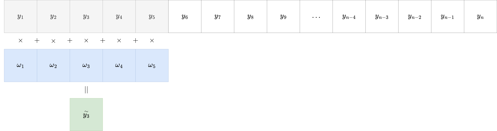
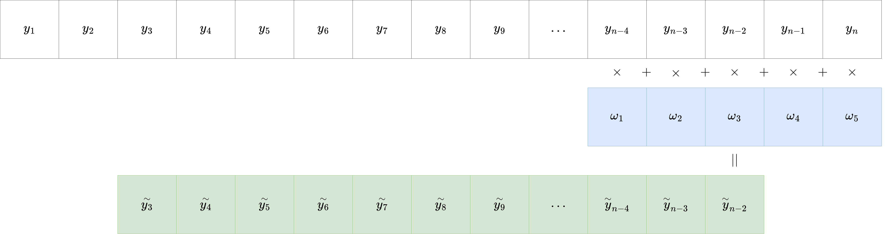
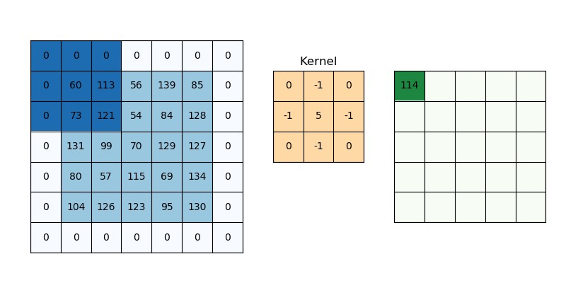
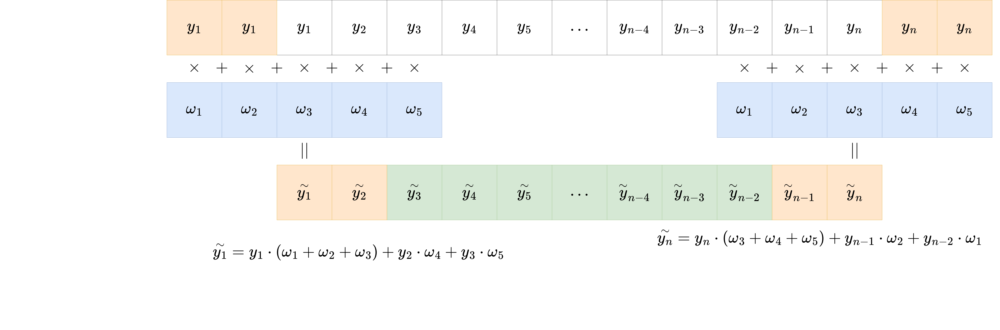
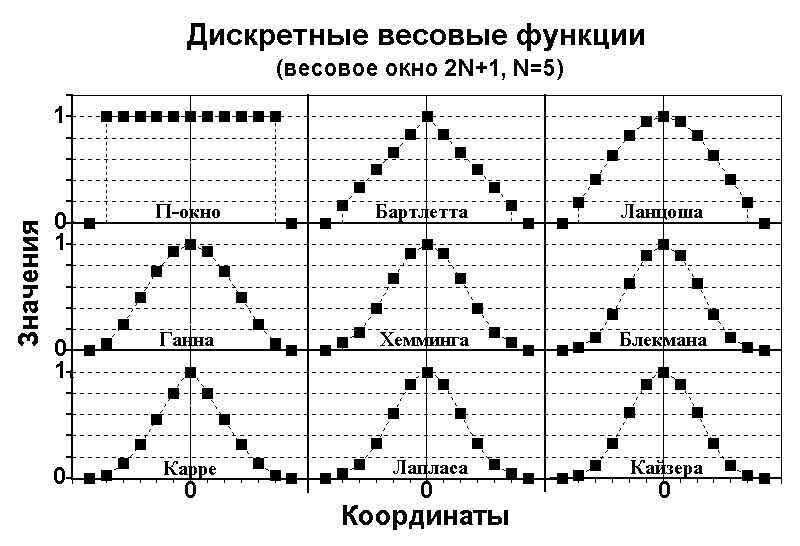

```{r, include=FALSE}
knitr::opts_chunk$set(echo = FALSE, dev="cairo_pdf", dpi = 500, out.width="60%", fig.align='center')
library(dplyr)
library(stringr)
library(ggplot2)
library(GGally)
```

# **Постановка задачи**

Для выполнения практического задания необходимо:
    1. открыть папку, соответствующую своей группе;
    2. открыть папку с вариантом, совпадающим с вашим номером в списке.

В папке два файла, которые содержат разные временные ряды. В первом файле находится ряд с синусоидальным трендом. Во втором - с линейным.

Необходимо выделить тренд используя 4 метода:
    1. простое скользящее среднее (SMA);
    2. взвешенное скользящее среднее (WMA) особо типа;
    3. экспоненциальное сглаживание (EMA);
    4. двойное экспоненциальное сглаживание (DEMA).

Каждый метод требует подбора некоторых параметров:

1. SMA и WMA - размер окна, EMA - параметр сглаживания A, DEMA - параметр сглаживания вокруг тренда A и параметр сглаживания самого тренда B.

Для весов в WMA использовать экспоненциальную весовую функцию: 

$$
\omega_i = \frac{e ^{-\varepsilon \cdot |i|}}{\sum\limits_{j=-m}^{m} e ^{-\varepsilon \cdot |j|}};\ \ i = -m, (-m+1), \dots, m;\ \ \varepsilon = 0.3.
$$

2. Необходимо подобрать оптимальные значения соотвествующих параметров, используя Q-статистику Льюнг-Бокса при m = 5. Оптимальными параметрами будем считать те, что минимизируют приведенную статистику.

3. В качестве размеров окна $w = 2 * m + 1$ перебрать значения $m\ =\ 3,\ 5,\ 7,\ 9$; в качестве параметров сглаживания: $\alpha,\ \gamma =  0.1, 0.2, \dots, 0.9$. Обратите внимание, что метод DEMA двухпараметрический, что требует выбрать оптимальную комбинацию сразу двух параметров $\alpha, \gamma$.

4. После подбора оптимальных параметров провести тест Дарбина-Уотсона $(m = 1, \alpha = 0.95)$ на данных после исключения выделенного тренда для каждого метода и каждого ряда.

5. В отчете изобразить графики исходных данных, графики трендов при оптимальных параметрах у каждого метода для каждого ряда, расчетные формулы, а также результаты тестов Дарбина-Уотсона.


# **Пример выполнения**

## **Скользящее среднее**

Метод простого скользящего среднего, с размером окна $w = 2 \cdot m + 1$, где $m\ -$ количество членов ряда в сумме по одной стороне от центрального значения, является частным случаем метода взвешенного скользящего среднего с равными весовыми коэффициентами:

$$
\overset{\sim}{y_t} = \sum\limits_{i = -m}^{m} \omega_i \cdot y_{t+i}, \quad \omega_i = \frac{1}{2 \cdot m + 1},
$$
где $y_t\ -$ исходные значения временного ряда в дискретных отсчётах $t$, $\omega_i\ -$ весовые коэффициенты окна сглаживания, $\overset{\sim}{y_t}\ -$ сглаженный ряд данных $y_t$.

Существует понятная проблема с крайними членами ряда. Представим ситуацию скользящего среднего для ряда данных $y_t$ с окном с $m = 2$. Изобразим на рисунке исходный ряд и окно сглаживания в виде массива, между которыми происходит операция свёртки:

$\ $




$\ $


Как показано на рисунке выше, сглаживание при помощи операции свертки с весовым окном не дает в классическом виде возможность получить в сглаженном ряде данных такое же количество элементов массива. Для проведения операции такой свёртки, окну необходимы крайние элементы, а центральный отображается в сглаженный первый элемент. Другими словами, чем больше окно сглаживания у нас будет, тем большее количество членов ряду будет отниматься в результате сглаживания.

Покажем также на рисунке полную картину такого сглаживания:

$\ $




$\ $


По изображению выше видно, что в нашем частном случае с обоих концов ряда удаляются по $m = 2$ значений с каждой стороны. Такую проблему в обработке изображений решают с помощью операции отступа (padding) на заданное количество единиц измерений с каждой стороны. С точки зрения обработки изображений, к картинке с каждой стороны добавляют значение $0$, для того, чтобы не вносить шум от краев изображения в модель обработки. 

$\ $




$\ $


Так же, как и в задачах обработки изображений, мы имеем возможность добавить отступ с каждой стороны, чтобы невелировать эффект сжатия ряда. Однако, данный отступ необходимо делать первым значением в начале ряда и последним значением в конце ряда соответсвенно по $m$ раз с каждой стороны, чтобы первые элементы сглаженного ряда не были занижены по уровню значений по сравнению с исходным рядом:


$\ $




$\ $

**Стоит сказать, что при сравнимо с размерами ряда больших значениях окна, метод отступа будет порождать большие ошибки сглаживания, так как будет вносить нетипичные значения ряда. Так что злоупотреблять данной техникой бывает опасно.**

Таким образом, получаем алгоритм простого скользящего среднего для сглаживания временного ряда с заданным размером окна $m$. Продемонстрируем его работу на массиве данных авиаперевозок $AirPassengers$, а также на ряде данных уровня воды в озере Гурон.

```{r, include=FALSE}
SMA <- function(series, width=3, weights=NA) {
  if (width < 0) {
    width <- 1
  }
  
  if (width %% 2 == 0) {
    width <- width + 1
  }
  
  if (any(is.na(weights))) {
    weights <- rep(1/width, width)
  }
  
  n <- length(series)
  new_data <- numeric(length = n - width + 1)
  for (i in (1 + (width - 1) / 2):(n - (width - 1) / 2)) {
    new_data[i - (width - 1) / 2] <- sum(series[(i - (width - 1) / 2):(i + (width - 1) / 2)] * weights)
  }
  return(new_data)
}
```


```{r, include=FALSE}
SMA_smooth <- function(data_frame, col, w = 3, pad = 1, weights = NA, name="WMA") {
  if (w > nrow(data_frame)) {
    cat("\nwindow size greater than number of values, window size set to maximum_possible")
    w <- nrow(data_frame)
  }
  
  if (pad < 0) {
    pad <- 0
  }
  
  if (pad > floor(w/2)) {
    pad <- floor(w/2)
  }
  
  if (any(is.na(weights))) {
    name <- "SMA"
  }
  
  padded_ts <- data_frame[, col]
  padded_ts <- c(rep(padded_ts[1], pad), 
                 padded_ts, 
                 rep(padded_ts[nrow(data_frame)], pad))
  
  smoothed_ts <- SMA(padded_ts, w, weights)
  data_frame[, paste0(col, "_smoothed_", name)] <- smoothed_ts
  return(data_frame)
}
```


Построим для временного ряда данных $AirPassengers$ график и график его сглаживания по методу $SMA$ с размером окна $m = 4$, $w = 2\cdot m + 1 = 9$. Данный временной ряд не является стационарным, поскольку его значения разброса вокруг линейного тренда растут с ростом значения этого тренда (гетероскедастичность). 

```{r}
df <- data.frame(time = as.numeric(time(AirPassengers)), flights = as.numeric(AirPassengers))
df <- SMA_smooth(df, "flights", 9, 4)

plot(df$time, df$flights, type = "o", pch = 19, col = "red", cex = I(0.7), lwd = I(1.2), 
     main = "Временной ряд авиаперевозок",
     xlab = "Время",
     ylab = "Количество пассажиров")
lines(df$time, df$flights_smoothed_SMA, col = "blue", lwd = I(1.3))
legend(x = 1949, y = 600, 
       legend = c("Исходный ряд", "SMA, m = 4"),
       col = c("red", "blue"),
       pch = c(19, -1),
       lty = c(1, 1))
grid()
```

На графике видно, как сглаженная реализация все еще имеет в себе периодическую компоненту относительно тренда, и логично использовать близкие к $m = 5, 6$ значения окон для сглаживания, чтобы избавиться от влияния сезонности и рассмотреть именно сам тренд 

```{r}
df <- data.frame(time = as.numeric(time(AirPassengers)), flights = as.numeric(AirPassengers))
df <- SMA_smooth(df, "flights", 11, 5)

plot(df$time, df$flights, type = "o", pch = 19, col = "red", cex = I(0.7), lwd = I(1.2), 
     main = "Временной ряд авиаперевозок",
     xlab = "Время",
     ylab = "Количество пассажиров")
lines(df$time, df$flights_smoothed_SMA, col = "blue", lwd = I(1.3))
legend(x = 1949, y = 600, 
       legend = c("Исходный ряд", "SMA, m = 5"),
       col = c("red", "blue"),
       pch = c(19, -1),
       lty = c(1, 1))
grid()
```

Для значений временного ряда $LakeHuron$ уровня воды озера Гурон построим также график и реализацию сглаживания простым методом скользящего среднего.

```{r}
df_huron <- data.frame(time = as.numeric(time(LakeHuron)), height = as.numeric(LakeHuron))

plot(df_huron$time, df_huron$height, type = "o", pch = 19, col = "red", cex = I(0.7), lwd = I(1.2), 
     main = "Временной ряд уровня воды в озере Гурон",
     xlab = "Время",
     ylab = "Уровень воды")
df_huron <- SMA_smooth(df_huron, "height", 3, 1)
lines(df_huron$time, df_huron$height_smoothed_SMA, col = "blue", lwd = I(1.3))
df_huron <- SMA_smooth(df_huron, "height", 7, 3)
lines(df_huron$time, df_huron$height_smoothed_SMA, col = "forestgreen", lwd = I(1.3))
df_huron <- SMA_smooth(df_huron, "height", 11, 5)
lines(df_huron$time, df_huron$height_smoothed_SMA, col = "black", lwd = I(1.3))
legend(x = 1874, y = 578, 
       legend = c("Исходный ряд", "SMA, m = 1", "SMA, m = 3", "SMA, m = 5"),
       col = c("red", "blue", "forestgreen", "black"),
       pch = c(19, -1, -1, -1),
       lty = c(1, 1, 1, 1))
grid()
```


Познакомившись с простым методом скользящего среднего далее переходим к обобщенному взвешенному скользящему среднему.

## **Взвешенное скользящее среднее**

Метод взвешенного скользящего среднего работает идентично методу простого скользящего среднего, за исключением необходимости определять саму весовую функцию метода сглаживания. Весовая функция $-$ метод определения значений весов исходя из определенного правила отображения номера элемента окна в его значение.

Весовых функций на практике встречается довольно много, и все их можно применять:


Из рисунка выше видно, что в методе простого скользящего среднего было использовано **П-окно**. В данной практике вам предлагается использовать экспоненциальную весовую функцию, также именуемую как **Пуассоновское сглаживание**:


```{r}
exponential_weights <- function(eps, w) {
  weights <- eps * exp(-eps * abs(-((w-1)/2):((w-1)/2)))
  return(weights / sum(weights))
}
```

```{r}
plot(x = -7:7, y = exponential_weights(0.3, w = 15), type ="o", pch = 19, 
     main = "Экспоненциальная весовая функция, eps = 0.3",
     xlab = "Номер веса в ядре сглаживания",
     ylab = "Значение веса")
grid()
```

Черными точками по оси ординат можно отследить значение веса в окне сглаживания алгоритма взвешенного скользящего среднего. 

Приведем пример работы сглаживания по данным авиаперевозок и уровня воды в озере Гурон.

```{r}
df <- SMA_smooth(df, "flights", 11, 5, weights=exponential_weights(0.1, 11))

plot(df$time, df$flights, type = "o", pch = 19, col = "red", cex = I(0.7), lwd = I(1.2), 
     main = "Временной ряд авиаперевозок",
     xlab = "Время",
     ylab = "Количество пассажиров")
lines(df$time, df$flights_smoothed_WMA, col = "blue", lwd = I(1.3))
legend(x = 1949, y = 600, 
       legend = c("Исходный ряд", "WMA, m = 5, eps = 0.1"),
       col = c("red", "blue"),
       pch = c(19, -1, -1),
       lty = c(1, 1, 1))
grid()
```


```{r}
df_huron <- data.frame(time = as.numeric(time(LakeHuron)), height = as.numeric(LakeHuron))

plot(df_huron$time, df_huron$height, type = "o", pch = 19, col = "red", cex = I(0.7), lwd = I(1.2), 
     main = "Временной ряд уровня воды в озере Гурон",
     xlab = "Время",
     ylab = "Уровень воды")
df_huron <- SMA_smooth(df_huron, "height", 9, 4, exponential_weights(eps=0.3, 9))
lines(df_huron$time, df_huron$height_smoothed_WMA, col = "blue", lwd = I(1.3))
df_huron <- SMA_smooth(df_huron, "height", 21, 11, exponential_weights(eps=0.3, 21))
lines(df_huron$time, df_huron$height_smoothed_WMA, col = "forestgreen", lwd = I(1.3))
df_huron <- SMA_smooth(df_huron, "height", 11, 5, exponential_weights(eps=1, 11))
lines(df_huron$time, df_huron$height_smoothed_WMA, col = "black", lwd = I(1.3))
legend(x = 1874, y = 578, 
       legend = c("Исходный ряд", 
                  "WMA, m = 4, eps = 0.3",
                  "WMA, m = 11, eps = 0.3",
                  "WMA, m = 5, eps = 1"),
       col = c("red", 
               "blue",
               "forestgreen",
               "black"),
       pch = c(19, -1, -1, -1),
       lty = c(1, 1, 1, 1))
grid()
```

## **Экспоненциальное сглаживание**

Экспоненциальное сглаживание - алгоритм, позволяющий рекуррентно оценивать новые значения сглаженного ряда по исходным данным, применяя следующие соотношения:

$$
\overset{\sim}{y}_t = \left\{ \begin{matrix} y_t, & t = 1,\\
\overset{\sim}{y}_{t-1} + \alpha\cdot ({y}_t - \overset{\sim}{y}_{t-1}), & t > 1,\end{matrix} \right.
$$

или

$$
\overset{\sim}{y}_t = \left\{ \begin{matrix} y_t, & t = 1,\\
\alpha \cdot {y}_t + (1 - \alpha) \cdot \overset{\sim}{y}_{t-1}, & t > 1,\end{matrix} \right.
$$

где $\alpha\ -$ коэффициент сглаживания (сила сглаживания) принимает значения в диапазоне от 0 до 1 в действительной области.

Коэффициент $\alpha$ влияет на степень восприятия истории. Чем ниже значение коэффициента, тем сильнее происходит именно сглаживание. Поскольку величины $\alpha$ и $(1 - \alpha)$ взаимнообратные, следовательно смысл коэффициента  $\alpha$ разнится с точностью до смены места их расстановки в зависимости выше.

```{r}
EMA <- function(data_frame, col, alpha = 0.1) {
  ts <- data_frame[, col]
  for (i in 2:length(ts)) {
    ts[i] = ts[i - 1] + alpha * (ts[i] - ts[i - 1])
  }
  data_frame[, paste0(col, "_smoothed_EXP")] <- ts
  return(data_frame)
}
```

Покажем работу алгоритма сглаживания на значениях ряда уровня воды озера Гурон


```{r}
df_huron <- data.frame(time = as.numeric(time(LakeHuron)), height = as.numeric(LakeHuron))

plot(df_huron$time, df_huron$height, type = "o", pch = 19, col = "red", cex = I(0.7), lwd = I(1.2), 
     main = "Временной ряд уровня воды в озере Гурон",
     xlab = "Время",
     ylab = "Уровень воды")
df_huron <- EMA(df_huron, "height", 0.1)
lines(df_huron$time, df_huron$height_smoothed_EXP, col = "blue", lwd = I(1.3))
df_huron <- EMA(df_huron, "height", 0.2)
lines(df_huron$time, df_huron$height_smoothed_EXP, col = "forestgreen", lwd = I(1.3))
df_huron <- EMA(df_huron, "height", 0.4)
lines(df_huron$time, df_huron$height_smoothed_EXP, col = "black", lwd = I(1.3))
legend(x = 1874, y = 578, 
       legend = c("Исходный ряд", 
                  "EMA, alpha = 0.1",
                  "EMA, alpha = 0.2",
                  "EMA, alpha = 0.4"),
       col = c("red", 
               "blue",
               "forestgreen",
               "black"),
       pch = c(19, -1, -1, -1),
       lty = c(1, 1, 1, 1))
grid()
```


## **Двойное экспоненциальное сглаживание**

Двойное экспоненциальное сглаживание осуществляется по следующим формулам с коэффициентами $\alpha,\gamma$, варьирующихся в пределах от $0$ до $1$ в действительной оси.

$$
\overset{\sim}{y}_t = \alpha \cdot y_t + (1-\alpha) \cdot (\overset{\sim}{y}_{t-1}+b_{t-1}),
$$

$$
b_t = \gamma \cdot (\overset{\sim}{y}_t - \overset{\sim}{y}_{t-1}) + (1-\gamma) \cdot b_{t-1},
$$

$$
\overset{\sim}{y}_1=y_1,\ \  b_1=y_2-y_1
$$

```{r}
DEMA <- function(data_frame, col, alpha=0.1, gamma=0.1) {
  ts <- data_frame[, col]
  S <- numeric(length(ts))
  b <- numeric(length(ts))
  S[1] <- ts[1]
  b[1] <- ts[2] - ts[1]
  for (i in 2:length(ts)) {
    S[i] <- alpha * ts[i] + (1 - alpha) * (S[i - 1] + b[i - 1])
    b[i] <- gamma * (S[i] - S[i - 1]) + (1 - gamma) * b[i - 1]
  }
  data_frame[, paste0(col, "_smoothed_DEMA")] <- S
  return(data_frame)
}
```

Продемонстрируем работу двойного экспоненциального сглаживания на примере временного ряда уровня воды в озере Гурон:

```{r, dpi = 200, fig.width=8, fig.height=8}
df <- DEMA(data_frame = df, col = "flights", alpha = 0.1, gamma = 0.9)


df_huron <- data.frame(time = as.numeric(time(LakeHuron)), height = as.numeric(LakeHuron))

plot(df_huron$time, df_huron$height, type = "o", pch = 19, col = "red", cex = I(0.7), lwd = I(1.2), 
     main = "Временной ряд уровня воды в озере Гурон",
     xlab = "Время",
     ylab = "Уровень воды")
df_huron <- DEMA(df_huron, "height", 0.9, 0.1)
lines(df_huron$time, df_huron$height_smoothed_DEMA, col = "blue", lwd = I(1.3))
df_huron <- DEMA(df_huron, "height", 0.7, 0.3)
lines(df_huron$time, df_huron$height_smoothed_DEMA, col = "forestgreen", lwd = I(1.3))
df_huron <- DEMA(df_huron, "height", 0.5, 0.9)
lines(df_huron$time, df_huron$height_smoothed_DEMA, col = "black", lwd = I(1.3))
legend(x = 1874, y = 578, 
       legend = c("Исходный ряд", 
                  "DEMA, alpha = 0.9, gamma = 0.1",
                  "DEMA, alpha = 0.7, gamma = 0.3",
                  "DEMA, alpha = 0.5, gamma = 0.5"),
       col = c("red", 
               "blue",
               "forestgreen",
               "black"),
       pch = c(19, -1, -1, -1),
       lty = c(1, 1, 1, 1))
grid()
```

Первый $\alpha$ отвечает за сглаживание ряда вокруг тренда, второй $\gamma$ — за сглаживание самого тренда. Чем выше значения, тем больший вес будет отдаваться последним наблюдениям и тем менее сглаженным окажется модельный ряд. Комбинации параметров могут выдавать достаточно причудливые результаты, особенно если задавать их руками. 

## **Q-статистика Льюнг-Бокса**

Временной ряд можно сглаживать по нескольким причинам, среди которых две очевидные:

1. Избавиться от случайных значений ряда вокруг тренда и сезонности и выделить их более значительно.

2. Выделить тренд, сгладив и случайные компоненты и сезонность вокруг тренда по известному колчиеству дней периода сезонной компоненты.

В каждом из выделенных случаев, проверка адекватности алгоритма сглаживания проводится по-разному. Для начала выделяют остатки ряда данных $$e_t = y_t - \overset{\sim}{y_t}$$, которые записываются отдельным временным рядом с теми же отсчётами. **Обратите внимание, что для методов сглаживания с окном (SMA, WMA) приходится либо рассматривать сглаженный ряд с дополненными исходными значениями ряда по краям, либо делать отступ перед сглаживанием**.

Для второго случая, когда необходимо просто выделить тренд из данных достаточно проверить остатки на нулевое среднее. Если среднее остатков не находится около нуля, то тренд найден недостаточно хорошо. Проверки на выявления сезонности вместе с трендом не существует в общем употреблении.

Для первого случая проверка намного сложнее. Для остатков нам необходимо убедиться в отсутствии их авкоррелированности на заданное количество лагов назад.
Если автокорреляционная функция остатков $e_t$ резко убывает (и находится около нуля), то остатки не коррелируют друг с другом и, похоже, что они случайны.

В качестве статистики для проверки отсутсвия автокорреляции остатков выступает Q-Статистика Льюнг-Бокса:

$$
Q = n \cdot (n - 2) \cdot \sum \limits_{k=1}^{m}\frac{r(k)^2}{n-k},
$$
где $r(k)\ -$ выборочная оценка автокорреляционной функции в лаге $k$ от текущего наблюдения:
$$
r(k) = \frac{(n-k)\cdot \sum\limits_{t=1}^{n-k}x_t \cdot x_{t+k} - \sum\limits_{t=1}^{n-k} x_t \sum\limits_{t=1}^{n-k} x_{t+k}}{\sqrt{(n-k)\sum\limits_{t=1}^{n-k}x_t^2 - (\sum\limits_{t=1}^{n-k}x_t)^2} \cdot \sqrt{(n-k)\sum\limits_{t=1}^{n-k}x_{t + k}^2 - (\sum\limits_{t=1}^{n-k}x_{t+k})^2}}
$$

Считается, что полученная величина имеет распределение $\chi^2$ c $m$ степенями свободы.
Если $Q$ оказывается больше критического значения, то признается наличие автокорреляции до $m$-ого порядка в исследуемом ряду.
Иначе считается, что автокорреляции нет и остатки признаются случайными.

В пакете R существует функция $Box.test(x, lag, type="Ljung-Box")$, которая предоставляет возможность тестировать ряд на автокорреляцию. Необходимо посчитать остатки и провести тест.

```{r, include=TRUE, echo=TRUE}
Box.test(x = df$flights - df$flights_smoothed_DEMA, lag = 5, type = "Ljung-Box")
```


# **Темы вопросов на защиту практической работы**


1. Понятие временного ряда (ВР). Стационарность и нестационарность ВР. Примеры ВР. Аддитивная и мультипликативная модели ВР
2. Методы сглаживания ВР: MA, WMA, SMA, EMA. 
3. Лаговый оператор. Модели с распределенным лагом. Лаги Алмон.
4. Тест Дарбина-Уотсона.
5. Q-стастистика Льюнга-Бокса и применение для подбора параметров статистических моделей обработки данных.


